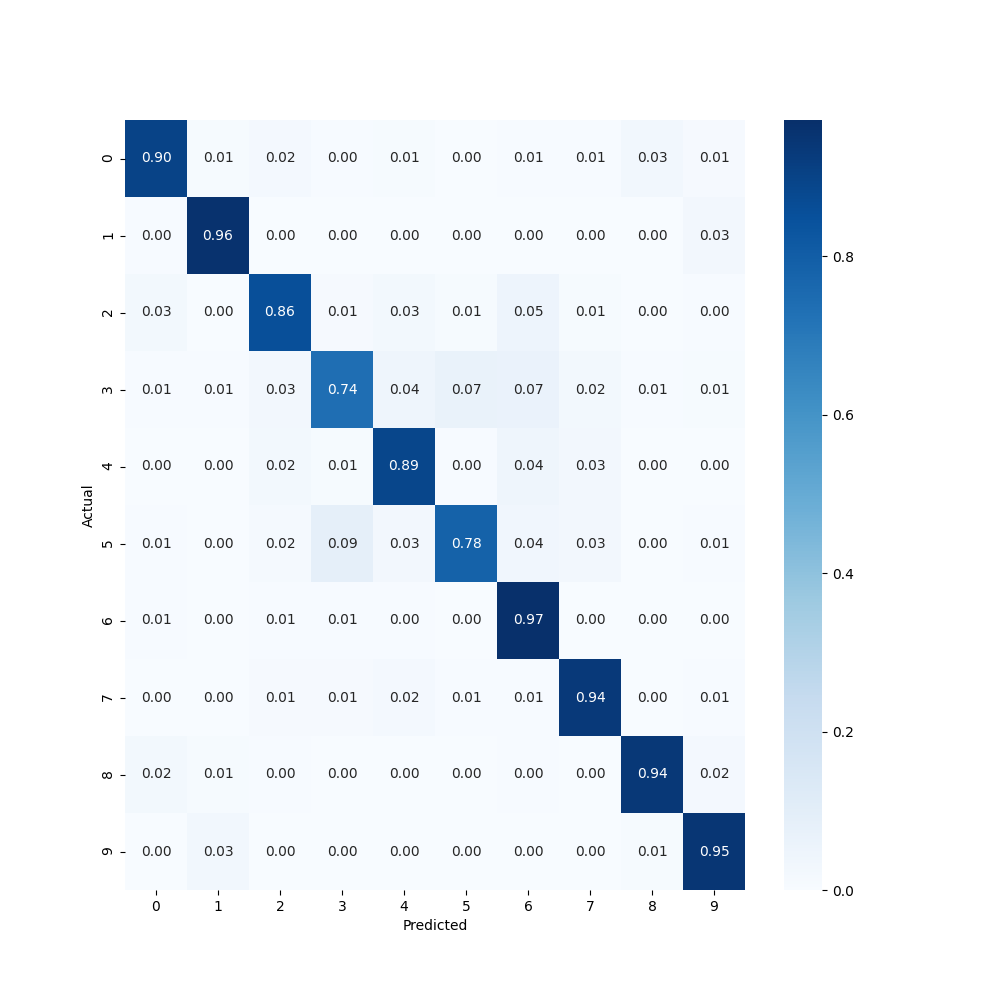

## Narrative CIFAR-10 technical test

Building a small model from scratch using the CIFAR-10 dataset. 89.29% test accuracy with minimal tuning.

I enjoyed the challenge of creating a small high-performance model from scratch. In industry, my usual approach to this would be to find the largest pre built model that would fit the requirements (< 1 million parameters and under 20ms inference time) and use transfer learning to limit time spent on the task, with minimal tuning. 

I chose to build out from a very simple network to show more details of what I consider a modern approach to ML problems - Rapid testing of hypotheses which leverage the latest tools and techniques. I wanted to avoid the approach of building a safe model and running 75+ epochs to produce a good result, although that would have taken a lot less time!

**The final model has over 87% accuracy on the 10th epoch.** This is without a lot of fine tuning and experimentation. To improve on this, I would next try a ResNet 18 or 20 structure with data augmentation, with and without transfer learning.

Any follow up should look at the difference between activation functions(mainly leaky ReLu and GELU, maybe elu), optimizers(RMSprop and the SGD variants), and tuning the TensorFlow data augmentation.

Keras was used for development speed and Notebook readability. 

Runs on Python 3.8.

### Getting started

Clone the repo, open your terminal and navigate to the main folder ```Narrative_CIFAR10```

**Training script** - copy and paste ```python3 cifar10_train.py``` into the terminal and hit enter.
The trained models are already available, so you don't need to run the whole training cycle.

**Test script and confusion matrix** - copy and paste ```python3 cifar10_test.py``` into the terminal and hit enter.

### CIFAR-10

The CIFAR-10 dataset has relatively simple images of 32 x 32 pixels, 10 categories, and 50,000 training examples. I chose to use Keras for this test because it allows rapid iteration of hypotheses, and it’s very readable in notebooks. My goal was to get 90% accuracy within the requirements. But 89% is ok for now.

### First experiment

_See notebook 1_

My first experiment was a relatively small CNN, expected to have average performance (70-85%). No dropout was present because of the size of the model. The potential of this architecture is limited, even with fine tuning, data augmentation, and dropout.

I chose the Adam optimizer, because it works fairly well on out of the box in Keras, and easily changed later.

```
Conv2D(32, relu)
MaxPooling2D(2,2)

Conv2D(64, relu)
MaxPooling2D(2,2)


Conv2D(64, relu)
MaxPooling2D(2,2)

Dense(128, relu)
Dense(softmax)

optimizer: adam
```

#### Choosing GELU and Adam

_See notebook 2_

I chose GELU for the activation function because of its recent success with models such as OpenAI’s GPT, and its growing popularity in the ML community. It is similar to leaky ReLU with that it can output negative numbers. I wanted to see how it would perform in a smaller network.

GELU is only in TF nightly, so I added a custom function in the script for it. However, this causes problems when trying to load a model saved from a checkpoint. Model.save still works and loads, though.

After verifying the model would train ok, I increased the learning rate to 0.003 (3x the standard).

```
Conv2D(32, GELU)
Conv2D(32, GELU)
MaxPooling2D(2,2)

Conv2D(64, GELU)
MaxPooling2D(2,2)

Conv2D(64, GELU)
MaxPooling2D(2,2)
Dropout(0.2)

Dense(256, GELU)
Dropout(0.4)
Dense(softmax)

optimizer: adam(lr=0.003)
```

### A larger model

_See notebook 3_

A slightly larger model still fits within the parameter requirements. Before adding any extras, I ran a quick test to see if performance was encouraging for the first 5 epochs. It was, so I began experimenting with the architecture to improve the accuracy.

Learning rate was key to get reasonably high accuracy with the limited amount of data and small model architecture. 

#### Dropout

I used reasonably high dropout to begin with, so the complexity of the model was increased and the learning rate could be tuned.

After the MaxPooling2D layer, dropout started at 0.25 for the first 32 Conv2D section, 0.3 for the second 64 Conv2D section, 0.35 for the Conv2D section, and 0.5 for the final Dense layer.

Training results were promising, so I moved on.

```
Conv2D(32, GELU)
Conv2D(32, GELU)
MaxPooling2D(2,2)
**Dropout(0.25)**

Conv2D(64, GELU)
MaxPooling2D(2,2)

Conv2D(64, GELU)
MaxPooling2D(2,2)
Dropout(0.4)

Dense(**512**, GELU)
Dropout(0.4)
Dense(softmax)

optimizer: adam(lr=0.003)
**callbacks: learning rate decay, early stopping**
```

### The final model

_See notebook 4_

The architecture for the final model builds from the third notebook. It's designed to be simple, and obviously isn't tuned to any great degree.

#### Data augmentation

Data augmentation was added next using **TensorFlow’s datagen**. It’s simple to get going, but not great to fine tune. 20 degrees of rotation and vertical flipping added too much complexity with a high learning rate. The model wasn't training well.

With batch normalization added, and the rotation decreased to 15 degrees, the model started to produce promising results. I decreased the size of the final dense layer to 256 reduce the complexity (and stay within the requirements).

#### Building out the platform and tuning

With the data augmentation working and the model training, I wrote out some helper functions and tests.

Keras has a very good callback API, which I leveraged to add in helper functions for dynamically decreasing learning rate (custom decay, scheduling, and ReduceLROnPlateau) and early stop functionality.

I quickly tried several optimizers and found **Adamax** to perform the best, even when using a learning rate of 0.0035 (3.5x more than default).

This model had now performed at 85%+ with several different hyperparameters.

With some hyperparameter tuning, a result of over 90% test accuracy is very likely achievable.

```
**Data augmentation: width shift, height shift, horizontal_flip**

Conv2D(32, GELU, **Batch Normalization**)
Conv2D(32, GELU, **Batch Normalization**)
MaxPooling2D(2,2)
Dropout(0.25)

Conv2D(64, GELU, **Batch Normalization**)
**Conv2D(64, GELU, Batch Normalization)**
MaxPooling2D(2,2)
**Dropout(0.3)**

Conv2D(64, GELU, **Batch Normalization**)
**Conv2D(64, GELU, Batch Normalization)**
MaxPooling2D(2,2)
Dropout(**0.4**)

Dense(**256**, GELU)
Dropout(**0.5**)
Dense(softmax)

optimizer: **Adamax(lr=0.0035)**
callbacks: learning rate decay, early stopping, **reduce lr on plateau**
```




## Validation / Test data!?

I used the test data as the validation data, due to the limited amount of training data available. This allowed rapid testing to see how approaches were trending. With data augmentation, the test data could be withheld and a train-validation split of 0.2 could be used (0.15 would be the absolute lowest I would go on this dataset with data augmentation). But with limited time and compute, I haven't tried this.

## Next steps

There are lots of ways that could improve performance:

1. Hyperparameter tuning
  * Testing new activation functions
  * Testing different optimizers
  * Adjusting learning rate, decay, and plateau controls
2. Different architectures
  * ResNet would be top of my priority list
3. Data augmentation
  * Reviewing 